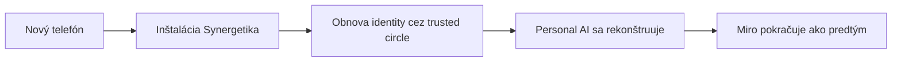

# Personal AI a používateľský model – Stručný prehľad

---

## Čo je Personal AI? [5, 34]

**Nie je to chatbot, nie je to black-box, nie je to centrálny model.**

Personal AI je **lokálny, evolučný, vysvetliteľný model používateľa**, ktorý:
- existuje **per používateľ**
- je uložený **primárne lokálne**
- je **dynamický** (mení sa v čase)
- je **vysvetliteľný** (vieme povedať, prečo sa rozhodol)
- reprezentuje **preferencie, záujmy, schopnosti a vzorce rozhodovania**

**Jadro definície:** *Personal AI je digitálne zrkadlo používateľa, ktoré sa učí z jeho rozhodnutí, ale nikdy ho nenahrádza.* [5]

---

## Z čoho sa Personal AI skladá? [5, 7, 34]

Personal AI nie je jeden objekt, ale **kompozícia 5 hlavných vrstiev**:

| Vrstva | Čo reprezentuje | Príklad |
|--------|----------------|---------|
| **Interest Model** | Čo používateľa zaujíma a ako silno | `food_business: 0.9` |
| **Capability Model** | V čom vie prispieť | `finance: 0.7`, `project_management: 0.6` |
| **Preference Model** | Ako rozmýšľa a rozhoduje sa | `practical_vs_conceptual: 0.58` |
| **Behavioral Model** | Ako sa reálne správa | odpovede, participácia, commitment |
| **Context Model** | Kde a v akej situácii je | lokalita, čas, dostupnosť |

**Dôležité:** Toto nie je hodnotenie človeka, ale **model správania**. [5]

---

## Štruktúrovaný Interest Model – to je novinka [34]

Interest Model už nie je plochý zoznam. Má **dve úrovne**:

### A. Kategórie (stromová štruktúra)
```
business (0.6)
├── small_business (0.7)
│   └── food_business (0.9)
└── corporate_business (0.2)
```
- Záujem o podkategóriu = záujem o nadkategóriu (s nižšou váhou)
- Záujem o nadkategóriu **nemusí** znamenať záujem o podkategóriu

### B. Tagy (grafová štruktúra)
```json
{ "#sustainable": 0.8, "#community": 0.7, "#local": 0.6 }
```
- Voľné, nehierarchické
- Môžu sa prekrývať s viacerými kategóriami

### Sémantické vzťahy medzi témami

Systém pozná vzťahy ako `parent_of`, `related_to`, `supports`, `contradicts`.

**Príklad propagácie:** Záujem o `food_business = 0.9` sa automaticky propaguje na `small_business = 0.45`, `sustainability = 0.27`, atď. [34]

---

## Ako sa Personal AI učí? [6]

**Učí sa primárne zo správania používateľa, nie z black-box ML.**

### Vstupy do učenia:
| Typ | Príklady |
|-----|----------|
| **Explicitné** | odpovede na otázky, výber možností, textové odpovede |
| **Implicitné** | preskočenie otázky, čas odpovede, návrat k téme |

**Neučí sa z:** skrytého sledovania, externých dát bez súhlasu. [5, 8]

### Kľúčové princípy učenia:
- **Inkrementálne** – po každej interakcii
- **Lokálne** – na zariadení
- **Vysvetliteľné** – rule + score based
- **Stabilizované** – smoothing, decay, hysterézia (proti „skáčaniu“ profilu)
- **Reverzibilné** – cez event log a rekonštrukciu

**Finálna veta:** *Personal AI sa učí z toho, čo používateľ robí – nie z toho, čo by mal robiť.* [6]

---

## Dátové zdroje – čo smieme a čo nie? [8]

| Kategória | Obsahuje | Váha v učení |
|-----------|----------|---------------|
| **Primárne (core)** | odpovede na otázky, explicitné rozhodnutia | najvyššia |
| **Sekundárne (implicit)** | čas odpovede, frekvencia, preskočenie | stredná |
| **Externé (voliteľné)** | sociálne siete, dokumenty, wearables | variabilná (nižšia) |

**Pravidlo:** Externé dáta len s **explicitným súhlasom**, transparentne, lokálne ak je to možné.

**Zakázané:** tiché napojenie, automatický scraping, skryté profilovanie.

**Princíp minimalizácie:** *Systém zbiera len toľko dát, koľko je potrebné na funkciu.* [8]

---

## Ako je používateľ reprezentovaný dátovo? [7]

**Tri vrstvy + event log:**

```
Raw Observations → Learning → Derived Profile → Snapshot
                        ↓
                   Event Log
```

| Vrstva | Účel | Príklad |
|--------|------|---------|
| **Raw Observations** | „Čo sa skutočne stalo“ | používateľ odpovedal na otázku |
| **Derived Profile** | Odvodené signály | interest_score pre tému = 0.8 |
| **Snapshot** | Aktuálny agregovaný stav (pre UI) | top témy, preferencie sumárne |
| **Event Log** | Audit, rekonštrukcia, učenie | `QuestionAnswered`, `InterestUpdated` |

**Čo profil NIE JE:** jedna pevná kategória, psychologická nálepka, black-box embedding. [7]

---

## Reciprocita – prečo sa niekomu oplatí participovať? [36]

**Základný princíp:** *Participácia generuje hodnotu pre samotného používateľa.*

### Čo získava aktívny používateľ?
- **Presnejší model** (lepšia personalizácia)
- **Relevantnejšie otázky** (nemusí opakovať to isté)
- **Hlbšie analýzy** (viac perspektív, lepšie odporúčania)

### Čo systém **NEROBÍ** (kľúčové):
- ❌ Žiadne body, karma, rebríčky
- ❌ Žiadne levely alebo úrovne
- ❌ Žiadne odomykanie funkcií
- ❌ Žiadne porovnávanie s ostatnými
- ❌ Žiadne notifikácie o participácii

### Ako používateľ vie, že je „odmenený“?
1. **Prirodzený pocit** – systém mu čoraz lepšie rozumie
2. **Spätná väzba v momente benefitu** – „Toto odporúčanie vzniklo vďaka tvojim odpovediam...“
3. **Binárny indikátor** (voliteľný) – „Tvoja participácia zlepšuje kvalitu systému“ (áno/nie)

**Decay participácie:** Staré zásluhy strácajú váhu (polčas 30 dní). Nejde o trest, ale o to, že staré dáta prestávajú byť relevantné. [36]

---

## Identity Recovery – čo keď stratím zariadenie? [37]

**Problém:** Strata dát ≠ strata súboru. Strata dát = strata časti digitálneho ja.

**Princíp:** *Digitálna identita musí byť obnoviteľná bez narušenia dôvery a súkromia.*

### Mechanizmus:
- **Local-first** – primárny model je lokálny
- **Distributed encrypted backup** – cez parent node alebo trusted circle
- **Split knowledge** – žiadna entita nemá kompletný prístup
- **User-controlled recovery** – iniciácia vždy na strane používateľa

**Systém NEROBÍ:** centralizovaný cloud ako jediný zdroj pravdy, automatické zdieľanie identity, obnovu bez explicitného súhlasu.

**Prečo je to dôležité:** *Používateľ nebude budovať digitálnu identitu, ak si nie je istý, že ju nikdy nestratí.* [37]

---

## Jednotný model entity (Node) – čo to znamená? [42]

**Všetko je Node.** Otázka, projekt, argument, téma, udalosť, osoba – všetky majú rovnakú základnú štruktúru.

```json
{
  "node_id": "proj_001",
  "node_type": "Project",
  "name": "Komunitná pizzéria",
  "relations": [...],
  "rights": {...}
}
```

### Výhody:
- Jednotná implementácia storage, sync, práv
- Konzistentné vzťahy medzi čímkoľvek
- Fraktálna vlastnosť (Node môže obsahovať iné Node-y)

### Typy Node:
`Question | Project | Argument | Topic | Event | Person | Branch | Thread`

### Vzťahy:
`parent_of`, `child_of`, `classified_as`, `supported_by`, `opposes`, `forked_from`, `merged_into`, `references`, `mentioned_in`

---

## Výstupy – na čo všetko Personal AI vplýva? [5, 6]

Personal AI ovplyvňuje:
- **Poradie otázok** – čo ukázať ako prvé
- **Výber tém** – čo je relevantné
- **Perspektívy** – ktorý uhol pohľadu preferovať
- **Odporúčania** – čo by používateľa mohlo zaujímať
- **Reflexiu** – aké spätnoväzbové otázky položiť

**Nevytvára:**
- Rozhodnutia za používateľa
- „Pravdu“
- Hodnotenie človeka

---

## Čo je zakázané / čo systém nerobí (zhrnutie)

| Zakázané | Dôvod |
|----------|-------|
| Black-box model bez vysvetlenia | Neudržateľné, neverí sa mu |
| Sledovanie bez súhlasu | Porušuje dôveru |
| Body, levely, rebríčky | Gamifikácia = manipulácia |
| Automatická obnova identity | Bezpečnostné riziko |
| Centrálny model | Porušuje ownership |

---

## Kľúčové pojmy na zapamätanie

| Pojem | Stručne |
|-------|---------|
| **Personal AI** | Digitálne zrkadlo používateľa |
| **Interest Model** | Čo používateľa zaujíma (strom + tagy + vzťahy) |
| **Reciprocita** | Participácia = lepšie výstupy (nie body) |
| **Identity Recovery** | Obnova digitálneho ja pri strate zariadenia |
| **Node** | Jednotná entita pre všetko v systéme |
| **Snapshot** | Aktuálny stav profilu pre UI |
| **Event Log** | Audit a rekonštrukcia zmien |

---

## Odkazy na dokumenty (pre hlbší ponor)

| Dokument | Zameranie |
|----------|-----------|
| [5] | Personal AI – definícia a štruktúra |
| [6] | Ako sa učí (learning model) |
| [7] | Ako je používateľ reprezentovaný dátovo |
| [8] | Aké dáta smieme použiť |
| [34] | Interest Model s taxonómiou a propagáciou |
| [36] | Reciprocita – prečo participovať |
| [37] | Obnova identity pri strate zariadenia |
| [42] | Jednotný model entity (Node) |

---

## Jedna veta na záver

> **Personal AI nie je chatbot ani black-box. Je to živý model používateľa, ktorý sa učí z jeho rozhodnutí, odmeňuje participáciu kvalitou (nie bodmi) a dá sa obnoviť, ak prídete o telefón.**

# Príklady – Personal AI v praxi

Tu sú konkrétne príklady, ako Personal AI funguje v reálnych situáciách.

---

## Príklad 1: Ako sa Personal AI učí z odpovedí

### Situácia
Používateľ Miro prvýkrát otvorí Synergetikum. Systém o ňom nič nevie.

### 1. deň – prvé otázky

Systém zobrazí všeobecné otázky (exploration):

| Otázka | Odpoveď Mira |
|--------|--------------|
| "Zaujíma ťa podnikanie?" | Áno (skóre 8/10) |
| "Čo si myslíš o veľkých korporáciách?" | Preskočil |
| "Máš skúsenosti s komunitnými projektmi?" | Áno (skóre 7/10) |
| "Zaujíma ťa politika?" | Nie (skóre 2/10) |

### Čo sa stane v profile [6, 34]:

```json
{
  "interest_model": {
    "categories": {
      "business": 0.7,
      "business.small_business": 0.6,
      "community": 0.65
    }
  },
  "confidence": {
    "business": 0.3,      // nízka, lebo len jedna otázka
    "community": 0.3
  }
}
```

### 7. deň – viac interakcií po sebe

Miro odpovedal na 20 otázok o podnikaní, z toho 15 pozitívne.

```json
{
  "interest_model": {
    "categories": {
      "business": 0.72,
      "business.small_business": 0.78,    // posilnilo sa
      "business.small_business.food_business": 0.85  // nová špecifická téma
    }
  },
  "confidence": {
    "business": 0.68      // vysoká, lebo veľa konzistentných odpovedí
  }
}
```

**Čo to znamená pre Mira:** [5]
- Systém mu začne ukazovať viac otázok o jedle a gastre
- Prestane mu ukazovať otázky o korporáciách (lebo ich ignoroval)
- Nemusí odpovedať na to isté znova – systém si pamätá

---

## Príklad 2: Propagácia záujmu cez vzťahy [34]

### Situácia
Miro má silný záujem o `food_business = 0.9`.

### Automatická propagácia

Systém použije sémantické vzťahy:

| Vzťah | Cieľová téma | Výpočet | Výsledný záujem |
|-------|--------------|---------|-----------------|
| `parent_of` | `small_business` | 0.9 × 0.5 | 0.45 |
| `related_to` | `sustainability` | 0.9 × 0.3 | 0.27 |
| `supports` | `local_farming` | 0.9 × 0.4 | 0.36 |
| `contradicts` | `industrial_farming` | 0.9 × (-0.2) | -0.18 |

### Čo to znamená pre Mira

Bez toho, aby odpovedal na jedinú otázku o `local_farming`, systém **odhadne**, že ho to môže zaujímať, a zobrazí mu relevantný obsah.

**Zároveň:** System mu **nezobrazí** témy o `industrial_farming`, lebo jeho záujem je negatívny.

---

## Príklad 3: Rozdiel medzi záujmom a schopnosťou [5, 34]

### Situácia
Miro odpovedal na otázky:

| Otázka | Odpoveď | Čo systém zistí |
|--------|---------|-----------------|
| "Zaujíma ťa financovanie?" | Áno (9/10) | **Záujem** o financie |
| "Vieš zostaviť rozpočet?" | Áno (8/10) | **Schopnosť** v rozpočtovaní |
| "Chcel by si sa učiť o výkazoch ziskov?" | Áno | **Záujem** učiť sa |

### Výsledný profil:

```json
{
  "interest_model": {
    "finance": 0.85
  },
  "capability_model": {
    "budgeting": 0.75,    // vie to
    "accounting": 0.2     // nevie to (zatiaľ)
  }
}
```

### Čo to znamená pre Mira

- Systém mu **ukáže otázky o účtovníctve** (lebo má záujem)
- Ale **neodporučí ho do role účtovníka** v projekte (lebo nemá schopnosť)
- Keď sa naučí, schopnosť sa zvýši a odporúčania sa zmenia

---

## Príklad 4: Reciprocita v praxi – dvaja používatelia [36]

### Používateľ A (aktívny)

| Akcia | Počet |
|-------|-------|
| Odpovedané otázky | 150 |
| Zapojenie do projektov | 5 |
| Zdieľanie v trusted circle | áno |

**Čo dostáva:**
- Personalizácia funguje po 30 odpovediach → presnosť +40 %
- Vidí 5+ perspektív pri každej otázke
- Dostáva odporúčania na projekty, ktoré presne sedia jeho schopnostiam
- **Spätná väzba:** "Toto odporúčanie vzniklo vďaka tvojim odpovediam v oblasti gastra."

### Používateľ B (pasívny)

| Akcia | Počet |
|-------|-------|
| Odpovedané otázky | 5 |
| Zapojenie do projektov | 0 |

**Čo dostáva:**
- Základná (baseline) personalizácia
- Vidí 1–2 perspektívy
- Všeobecné odporúčania, menej relevantné
- **Žiadna penalizácia** – systém funguje, ale nie je tak dobrý

### Kľúčové:

> Pasívny používateľ **netrpí**. Len aktívny **získava viac**.

Žiadne body, žiadne rebríčky, žiadne "si v top 10%". [36]

---

## Príklad 5: Ako Personal AI ovplyvňuje poradie otázok

### Mirov profil [34]
```json
{
  "interest_model": {
    "business.small_business.food_business": 0.9,
    "sustainability.local_food": 0.85,
    "technology": 0.3,
    "politics": 0.1
  },
  "preference_model": {
    "practical_vs_conceptual": 0.7  // praktický typ
  }
}
```

### 10 otázok čakajúcich na zobrazenie:

| Otázka | Téma | Typ | Vypočítaná priorita |
|--------|------|-----|---------------------|
| "Akú margžu plánuješ?" | food_business | praktická | **0.95** (vysoký záujem + preferencia) |
| "Kde získaš suroviny?" | local_food | praktická | **0.92** |
| "Aké sú trendy v gastre?" | food_business | konceptuálna | **0.65** (záujem áno, ale preferuje praktické) |
| "Čo si myslíš o AI?" | technology | konceptuálna | **0.25** |
| "Kto by mal vyhrať voľby?" | politics | - | **0.05** |

### Výsledok

Miro uvidí v prvom rade praktické otázky o gastre a lokálnych potravinách. Otázky o politike sa mu zobrazia, až keď odpovie na všetky relevantnejšie – alebo vôbec, ak ich stále preskakuje.

**Exploration factor:** 10 % otázok bude náhodných mimo jeho záujmov, aby sa neuzavrel do bubliny. [34]

---

## Príklad 6: Identity Recovery – strata telefónu [37]

### Situácia
Miro používa Synergetikum 6 mesiacov. Jeho Personal AI má:
- 200 odpovedí
- 3 projekty, ktoré sleduje
- Vybudované preference a záujmy

Jedného dňa **stratí telefón**.

### Čo sa nestane:
- Jeho digitálna identita nezmizne
- Nemusí začínať od nuly

### Čo sa stane:



### Mechanizmus:
1. Miro má **trusted circle** – 3 priatelia, ktorí mu dôverujú
2. Každý z nich má **šifrovanú časť** Mirovho modelu
3. Nikto nemá celok
4. Miro požiada o recovery, systém zloží časti dokopy
5. **Hotovo** – jeho Personal AI je späť

### Bez toho:
> Miro by po strate telefónu povedal: "Šesť mesiacov preč. Už nikdy viac."

---

## Príklad 7: Personal AI ako kompozícia (žiadny blob) [7]

### Ako to **nevyzerá** (zlé):
```json
{
  "user_model": {
    "magic_blob": "0x7F45... (nerozumiem tomu, neviem to rozšíriť)"
  }
}
```

### Ako to **vyzerá** (správne):

```json
// PersonalAIProfile – hlavička
{
  "user_id": "miro_001",
  "profile_version": 17,
  "confidence_overall": 0.68
}

// InterestProfile – samostatne
{
  "user_id": "miro_001",
  "interests": [
    { "topic": "food_business", "score": 0.85, "confidence": 0.74 },
    { "topic": "community", "score": 0.77, "confidence": 0.69 }
  ]
}

// PreferenceProfile – samostatne
{
  "user_id": "miro_001",
  "preferences": {
    "practical_vs_conceptual": 0.7,
    "risk_tolerance": 0.6
  }
}

// EventLog – pre audit
{
  "user_id": "miro_001",
  "events": [
    { "type": "question_answered", "topic": "food_business", "timestamp": "..." },
    { "type": "interest_updated", "delta": "+0.05", "reason": "consistent_answers" }
  ]
}
```

### Výhody tohto prístupu:
- Môžem aktualizovať len záujmy, nie celý profil
- Vidím históriu zmien (audit)
- Viem povedať: "Prečo si myslíš, že Miro má rád jedlo?" – lebo odpovedal na 15 otázok
- Dá sa to rozširovať – nová dimenzia = nová tabuľka, nie zmena celého modelu

---

## Príklad 8: Čo systém **nerobí** (kľúčové príklady)

### ❌ Nerobí toto:

| Čo by zlý systém robil | Čo Synergetikum robí |
|------------------------|----------------------|
| "Miro má skóre 84 bodov." | Žiadne skóre. Vôbec. |
| "Miro je v top 10% používateľov." | Žiadne porovnávanie. |
| "Miro je introvertný typ osobnosti." | Žiadne psychologické nálepky. |
| "Gratulujeme, dosiahol si level 5!" | Žiadne levely, žiadna gamifikácia. |
| Zobrazí notifikáciu: "Odmeňujeme ťa za 10 odpovedí" | Žiadne notifikácie o participácii. |
| "Prečítali sme tvoje správy, aby sme ťa spoznali." | Len explicitné odpovede, žiadne skryté sledovanie. |

### ✅ Robí toto:

| Čo používateľ vidí / zažíva |
|----------------------------|
| "Systém mi čoraz lepšie rozumie." (prirodzený pocit) |
| "Toto odporúčanie vzniklo vďaka tvojim odpovediam o gastre." (spätná väzba v momente) |
| "Tvoja participácia zlepšuje kvalitu systému." (áno/nie indikátor – žiadne percentá) |
| Otázky sú relevantné, nemusí opakovať to isté. |

---

## Príklad 9: Detekcia náhodných odpovedí (proti spamu) [36]

### Situácia
Miro sa nudí a začne náhodne klikať na odpovede.

| Čas odpovede | Vzorec | Detekcia |
|--------------|--------|----------|
| 0.5 sekundy | Áno, Nie, Áno, Nie, Áno | ✅ náhodné (príliš rýchle) |
| 0.3 sekundy | Všetko Áno | ✅ náhodné (extrémna jednostrannosť) |
| 10 sekúnd | Konzistentné odpovede | ❌ nie je náhodné |

### Čo systém urobí:
- Tieto odpovede **ignoruje** – nezapočítajú sa do participácie
- **Nepenalizuje** Mira – jeho existujúci profil zostáva
- **Neoznačí** Mira ako "spamera"

### Prečo toto nie je problém:
> Falošná participácia nepoškodzuje systém – len nemá žiadny efekt.

---

## Príklad 10: Decay participácie [36]

### Miro bol aktívny:
| Mesiac | Odpovede | Participačná úroveň |
|--------|----------|---------------------|
| Január | 50 | vysoká |
| Február | 45 | vysoká |
| Marec | 40 | vysoká |

### Potom Miro odcestoval a nepoužíval systém:

| Čas od poslednej aktivity | Participačná úroveň |
|---------------------------|---------------------|
| Deň 0 | vysoká |
| Deň 30 | stredná (polčas rozpadu) |
| Deň 60 | základná |
| Deň 90 | základná (nižšie už neklesne) |

### Čo to znamená pre Mira:
- Keď sa vráti, nedostane hneď rovnakú kvalitu personalizácie
- Ale **netrestá ho to** – po pár odpovediach sa vráti na pôvodnú úroveň
- Systém jednoducho povedal: "Tvoje staré odpovede už nie sú relevantné, lebo si dlho nebol aktívny."

---

## Zhrnutie – Personal AI v jednej tabuľke

| Čo chceme | Ako to Personal AI robí |
|-----------|-------------------------|
| Pozná moje záujmy | Štruktúrovaný Interest Model (strom + tagy + vzťahy) |
| Učí sa zo mňa | Behavior-based learning, nie black-box ML |
| Nie je creepy | Len explicitné odpovede, žiadne skryté sledovanie |
| Dá sa obnoviť pri strate telefónu | Distributed encrypted backup cez trusted circle |
| Odmeňuje participáciu | Lepšia kvalita výstupov, nie body ani levely |
| Je transparentný | Event log ukáže, prečo sa čo zmenilo |
| Nehodnotí ma | Žiadne psychologické nálepky, žiadne skóre osobnosti |