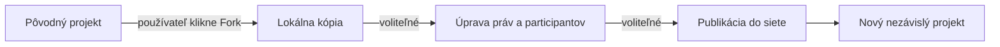

# 🧾 ADR-030: Sync & Persistence Strategy (Version 2.0)

> **Zmeny oproti Version 1.0:**
> - **Doplnená časť 7:** Nemenný audit log (immutable audit trail)
> - **Doplnená časť 8:** Forkovanie ako mechanizmus decentralizovanej evolúcie
> - **Rozšírená časť 9:** Branching vs Forking – jasné rozlíšenie
> - **Rozšírená časť 14:** Väzby na ADR-042 (Unified Entity Model)

---

## 1. 📌 Status

**Proposed (Version 2.0)**

---

## 2. 🎯 Kontext

Synergetikum pracuje s týmito základnými objektmi:

* Personal AI modely,
* otázky a odpovede,
* distribuované projekty,
* vetvy projektov,
* argumenty,
* support signály,
* view projekcie.

Tieto objekty existujú v prostredí, ktoré má nasledujúce vlastnosti:

* systém je peer-to-peer,
* uzly môžu byť offline,
* mobil je primárne zariadenie,
* parent node je voliteľný,
* používateľské dáta majú zostať lokálne,
* projektové objekty sa vyvíjajú v čase,
* konflikty nemajú končiť chybou, ale vetvením.

---

### Problém

Je potrebné definovať:

👉 **ako budú objekty systému ukladané, synchronizované a udržiavané v čase**

tak, aby:

* systém ostal decentralizovaný,
* bol použiteľný na mobile,
* bol odolný voči offline režimu,
* **umožňoval nemenný audit log (nikto nemôže prepísať históriu)**,
* **umožňoval forkovanie celých projektov aj s históriou**,
* a nevyžadoval vlastný extrémne komplikovaný sync engine od nuly.

---

### Kľúčová otázka

👉
**Aký model synchronizácie a perzistencie má Synergetikum použiť, aby bol realisticky implementovateľný a zároveň kompatibilný s víziou systému vrátane nemennosti a forkovania?**

---

## 3. ⚖️ Rozhodnutie

Synergetikum použije:

👉 **hybridnú local-first sync & persistence stratégiu**

Tento model kombinuje:

* **lokálny stav** ako primárny zdroj používateľskej skúsenosti,
* **distribuovanú synchronizáciu zmien** medzi relevantnými uzlami,
* **snapshoty a históriu** pre audit, vetvenie a rekonštrukciu,
* **branching namiesto tvrdého konfliktu**,
* **nemenný audit log** pre overiteľnú históriu,
* **forkovanie** pre decentralizovanú evolúciu bez centrálnej autority.

---

## 4. 🧠 Hlavný princíp

Systém nebude stavať na:

❌ jednom centrálnom úložisku
❌ jednej „master“ verzii projektu
❌ plnom Git modeli ako jadre runtime
❌ vlastnom sync engine od nuly v prvej fáze
❌ prepisovateľnej histórii

Namiesto toho bude stáť na tomto princípe:

👉
**každý uzol drží svoj lokálny stav, synchronizujú sa len relevantné zmeny, história sa uchováva oddelene od živého runtime stavu, je nemenná a každý projekt môže byť forknutý.**

---

## 5. 🧩 Architektonické vrstvy perzistencie

### 5.1 Local Runtime State

Každý uzol drží lokálny pracovný stav objektov, ktoré sú preň relevantné.

To znamená:

* používateľ má lokálnu kópiu svojich otázok,
* lokálnu interpretáciu projektov,
* lokálny stav relevantných vetiev,
* lokálny stav support signálov,
* lokálny stav participácie.

Táto vrstva je:

* rýchla,
* offline-first,
* optimalizovaná pre používateľskú skúsenosť.

👉 Toto je hlavný zdroj pravdy pre UX daného používateľa.

---

### 5.2 Sync Event Layer

Medzi uzlami sa neposielajú celé objekty pri každej zmene.

Synchronizujú sa prednostne:

* udalosti,
* zmeny,
* delty,
* nové vetvy,
* aktualizácie supportu,
* nové argumenty,
* zmeny lifecycle stavu.

Táto vrstva je:

* ľahšia než posielanie celých snapshotov,
* prirodzenejšia pre offline P2P,
* vhodná pre postupnú rekonštrukciu stavu.

👉 Sieťou má tiecť zmena, nie celý svet.

---

### 5.3 Derived State Layer

Aktuálny stav projektu alebo vetvy sa neukladá len ako „ručný dokument“, ale sa **odvodzuje** zo série zmien a lokálne sa materializuje do použiteľného snapshotu.

To znamená:

* eventy sú zdroj evolúcie,
* odvodený stav je zdroj UX.

👉 Systém žije na aktuálnych snapshotových stavoch, ale vie ich spätne vysvetliť cez históriu.

---

### 5.4 Snapshot & Audit Layer

Významné stavy objektov sa ukladajú ako snapshoty.

Používajú sa na:

* zrýchlenie rekonštrukcie,
* audit,
* rollback,
* branching,
* obnovu po dlhšom offline režime,
* **zakladanie forkov**.

Táto vrstva nie je primárny runtime mechanizmus, ale stabilizačná vrstva systému.

👉 Nie všetko sa má počítať z nekonečného streamu od začiatku.

---

## 6. 🔄 Sync model

### 6.1 Local-first ako default

Každý uzol musí vedieť fungovať plnohodnotne aj bez siete.

To znamená:

* používateľ vie čítať a reagovať aj offline,
* jeho Personal AI vie lokálne vyhodnocovať a filtrovať,
* lokálne zmeny sa zaznamenávajú bez potreby okamžitého potvrdenia zo siete.

---

### 6.2 P2P sync ako eventual process

Synchronizácia prebieha:

* keď sú uzly dostupné,
* keď sú relevantné,
* keď Participation Filter dovolí výmenu,
* keď sú splnené podmienky siete a zariadenia.

Systém predpokladá:

👉 **eventual consistency**, nie okamžitú globálnu synchronizáciu.

---

### 6.3 Konflikt ≠ chyba

Ak sa na dvoch uzloch objaví:

* nekompatibilná zmena,
* zásadne odlišný smer,
* odlišná interpretácia projektu,

systém to nemá chápať ako chybu synchronizácie.

Má to chápať ako:

👉 **signál pre branching**

Toto je zásadné.

---

## 7. 🔒 Nemenný audit log (Immutable Audit Trail)

### 7.1 Princíp

> **Žiadna zmena v histórii projektu nesmie byť vymazaná alebo prepísaná.**

Toto je základný kameň dôvery v decentralizovaný systém.

### 7.2 Čo sa loguje

Každá zmena, ktorá mení stav projektu alebo akéhokoľvek Node (ADR-042), vytvára záznam v audit logu:

| Typ udalosti | Popis |
|---|---|
| `NODE_CREATED` | Vytvorenie nového Node (projekt, argument, vetva, téma) |
| `NODE_UPDATED` | Zmena atribútov Node |
| `NODE_DELETED` | Označenie Node ako deleted (soft delete, história ostáva) |
| `RELATION_ADDED` | Pridanie vzťahu medzi dvoma Node-mi |
| `RELATION_REMOVED` | Odstránenie vzťahu |
| `BRANCH_CREATED` | Vytvorenie novej vetvy |
| `BRANCH_MERGED` | Zlúčenie vetvy |
| `FORK_CREATED` | Vytvorenie forku projektu |
| `STATE_CHANGED` | Zmena stavu projektu (Ideation → Proposal → Active) |
| `SUPPORT_SIGNAL` | Zmena support/alignment signálu |

### 7.3 Štruktúra audit záznamu

```json
{
  "entry_id": "string (UUID alebo multihash)",
  "timestamp": "ISO timestamp (UTC)",
  "node_id": "string (ktorého Node sa zmena týka)",
  "event_type": "enum (NODE_CREATED | NODE_UPDATED | RELATION_ADDED | ...)",
  "previous_state_hash": "string (hash predchádzajúceho stavu)",
  "new_state_hash": "string (hash nového stavu)",
  "delta": "object (zmena v JSON Patch alebo podobnom formáte)",
  "initiated_by": "string (node_id používateľa, ktorý zmenu vykonal)",
  "signature": "string (kryptografický podpis iniciátora)",
  "parent_entry_id": "string (odkaz na predchádzajúci záznam pre daný Node)"
}
```

### 7.4 Kryptografická integrita

* Každý záznam je podpísaný používateľom, ktorý zmenu vykonal.
* Záznamy tvoria Merkle tree alebo hash chain pre každý Node.
* `previous_state_hash` zabezpečuje, že žiadny záznam nemôže byť vymazaný bez porušenia reťaze.
* Akýkoľvek uzol v sieti môže overiť integritu histórie.

### 7.5 Kto môže čítať audit log

* `owner` projektu – plný prístup k histórii
* `participant` – prístup k histórii vetiev, v ktorých participuje
* `observer` – len k historickým snapshotom, nie k detailným zmenám
* Nikto nemôže **meniť** audit log.

### 7.6 Čo nie je v audit logu

* Osobné dáta používateľov (tie zostávajú v Personal AI modeli)
* Dočasné view projekcie (odvodzujú sa zo stavu, nie sú samostatnou históriou)
* Lokálne preferencie a nastavenia (nie sú súčasťou distribuovaného projektu)

### 7.7 Prečo je to dôležité

Bez nemenného audit logu:

* nie je možné overiť, či niekto neprepísal históriu
* dôvera v decentralizovaný systém je nemožná
* forkovanie stráca zmysel (nevieme, z čoho vychádzame)
* systém je otvorený manipulácii (porušuje ADR-003)

---

## 8. 🔱 Forkovanie (Forking) ako mechanizmus decentralizovanej evolúcie

### 8.1 Princíp

> **Akýkoľvek používateľ môže kedykoľvek vytvoriť fork (klon) celého projektu aj s jeho históriou, právami a vzťahmi.**

Forkovanie je základný mechanizmus pre:

* riešenie neprekonateľných konfliktov bez centrálnej autority
* experimentovanie s alternatívnymi smermi
* ochranu pred „zlým“ vedením projektu
* umožnenie inovácií bez potreby povolenia

### 8.2 Čo fork obsahuje

Pri vytvorení forku sa kopíruje:

* všetky Node-y projektu (vrátane všetkých vetiev)
* kompletný audit log (nemenná história)
* vzťahy medzi Node-mi
* snapshoty (pre rýchlu rekonštrukciu)
* atribúty a content Node-ov

**Nekopíruje sa:**

* zoznam participantov (tí si vyberú, ku ktorému forku sa pripoja)
* osobné dáta participantov
* lokálne view projekcie

### 8.3 Vzťah medzi pôvodným projektom a forkom

Fork vytvára nový Node (typ `Project`) so vzťahom:

```json
{
  "target_id": "original_project_id",
  "relation_type": "forked_from",
  "metadata": {
    "forked_at": "ISO timestamp",
    "forked_by": "user_id",
    "reason": "string (voliteľný)"
  }
}
```

Pôvodný projekt o svojich forkoch **nemusí vedieť** – to je decentralizačná vlastnosť. Fork existuje nezávisle.

### 8.4 Proces forkovania



1. Používateľ vyberie projekt, ktorý chce forknúť.
2. Systém vytvorí lokálnu kópiu všetkých relevantných dát.
3. Používateľ môže (ale nemusí) upraviť práva a zoznam participantov.
4. Fork môže byť publikovaný do siete ako nový nezávislý projekt.
5. Pôvodný projekt o forku nemusí byť notifikovaný (decentralizácia).

### 8.5 Fork vs Branch – jasné rozlíšenie

| Aspekt | Branch | Fork |
|---|---|---|
| Vzťah k pôvodu | Zostáva v rámci toho istého projektu | Nový nezávislý projekt |
| História | Zdieľa históriu s hlavnou vetvou | Kopíruje celú históriu |
| Zlúčenie (merge) | Možné späť do hlavnej vetvy | Teoreticky možné, ale nie je cieľ |
| Governance | Rovnaká ako projekt | Môže mať vlastnú governance |
| Participant | Tí istí participanti | Môže mať úplne iných |
| Primárny účel | Paralelný vývoj v rámci zhody | Nezávislá evolúcia pri nezhode |

### 8.6 Kedy forkovať namiesto branch

* Keď dôjde k neprekonateľnej nezhode v smere projektu.
* Keď sa časť komunity chce oddeliť a ísť vlastnou cestou.
* Keď pôvodný projekt zamrzol alebo je opustený.
* Keď chce používateľ experimentovať bez ovplyvňovania hlavného projektu.
* Keď pôvodný projekt porušuje princípy, ktoré sú pre používateľa dôležité.

### 8.7 Forkovanie a trust

* Fork nemá automaticky žiadnu dôveru od pôvodného projektu.
* Dôvera sa buduje odznova (alebo sa prenáša cez Trusted Circles).
* Používateľ môže byť participantom viacerých forkov toho istého pôvodného projektu.

### 8.8 Technická implementácia forku

Fork sa realizuje ako:

1. **Kópia snapshotu** – aktuálny stav projektu.
2. **Kópia audit logu** – celá história (nemenná).
3. **Zmena root Node ID** – nový projekt má nový `node_id`.
4. **Pridanie vzťahu `forked_from`** – odkaz na pôvodný projekt.
5. **Reset práv** – fork má svojho vlastného `owner` (zakladateľ forku).

### 8.9 Prečo je forkovanie dôležité

Bez forkovania:

* pri nezhode musí jedna strana ustúpiť alebo odísť
* vzniká tlak na centralizované rozhodovanie
* systém je de facto centralizovaný, aj keď technicky nie je
* porušuje sa princíp „žiadna centrálna autorita“

---

## 9. 🌳 Branching vs Forking – komplexné rozlíšenie

Branching a forkovanie sú dva komplementárne mechanizmy:

| | Branch | Fork |
|---|---|---|
| **Účel** | Paralelný vývoj v rámci zhody | Nezávislá evolúcia pri nezhode |
| **Vzťah** | Hierarchický (vetva patrí projektu) | Nezávislý (fork je samostatný projekt) |
| **Merge** | Bežná operácia | Výnimočná, komplikovaná |
| **História** | Zdieľaná (pred bodom vetvenia) | Kopírovaná (celá) |
| **Participanti** | Rovnaký pool | Môže byť úplne odlišný |
| **Governance** | Rovnaká ako projekt | Môže byť vlastná |

👉 **Pravidlo:** Ak sa skupina zhodne na smere, použije branch. Ak sa nezhodne, použije fork.

---

## 10. 🧱 Prečo nie čistý Git model

Git-like myslenie je užitočné pre:

* históriu,
* vetvenie,
* snapshoty,
* lineage.

Ale Git nie je vhodný ako celý runtime model systému, pretože:

* je príliš rigidný pre živý kolaboratívny objekt,
* prirodzene vedie k manuálnemu merge mindsetu,
* je príliš „developer-native“,
* nehodí sa ako hlavný interakčný model pre mobile-first systém.

👉 Git-like princípy budú použité skôr v audit/snapshot vrstve než v každodennom live sync jadre.

---

## 11. 🧠 Prečo nie vlastný sync engine od nuly

Vlastný sync engine od nuly je architektonicky lákavý, ale prakticky veľmi rizikový.

Riziká:

* extrémna komplexita,
* dlhý čas do prvého použiteľného výsledku,
* vysoká pravdepodobnosť chýb v konflikte, offline režime a merge,
* odčerpanie energie z hlavnej hodnoty produktu.

👉 Sync má byť infra vrstva, nie hlavný spotrebiteľ celej firmy.

---

## 12. ✅ Preferovaný technický smer

Na úrovni princípu sa rozhodujeme pre:

👉 **local-first distribuovaný objektový model s eventovým syncom, snapshotmi, nemenným audit logom a forkovaním**

To znamená:

* runtime stav je lokálny,
* zmeny sú eventy (zaznamenané v audit logu),
* významné body sú snapshoty,
* vetvenie rieši konflikty,
* **nemenný audit log zabezpečuje overiteľnosť histórie**,
* **forkovanie umožňuje decentralizovanú evolúciu**,
* používateľ pracuje so snapshot/view vrstvou, nie s raw syncom.

Tento smer je bližší local-first / CRDT svetu než tradičnému Git-only svetu. CRDT frameworky ako Yjs alebo C# orientované knižnice typu Harmony ukazujú, že offline-first kolaboratívne objekty sú reálny smer, aj keď nie všetko treba prebrať 1:1.

---

## 13. 🪜 Fázovanie implementácie

Aby nás to „nezabilo“, sync stratégia musí mať fázy.

### Fáza 1 – Single-node truth with export/import sync

* projekt vzniká lokálne,
* zmeny sú zaznamenávané ako eventy (začiatok audit logu),
* snapshoty existujú,
* sync je ešte jednoduchý a obmedzený,
* **forkovanie je len lokálne (kópia projektu)**.

Cieľ:

* overiť Project Object Model,
* overiť event model,
* overiť vetvenie,
* overiť základ audit logu.

---

### Fáza 2 – Trusted-circle sync

* relevantné uzly si vymieňajú eventy,
* rekonštruujú lokálny stav,
* vzniká reálny distributed object model,
* **audit log sa synchronizuje medzi participantmi**,
* **forkovanie sa môže šíriť v rámci trusted circle**.

Cieľ:

* overiť P2P synchronizáciu bez masívnej siete,
* overiť distribúciu audit logu.

---

### Fáza 3 – Parent node acceleration

* parent node pomáha s:

  * dlhšou históriou,
  * snapshotmi,
  * kompakciou eventov,
  * rýchlejšou rekonštrukciou,
  * **overovaním integrity audit logu**.

Cieľ:

* odľahčiť mobil,
* zvýšiť robustnosť,
* umožniť verifikáciu histórie.

---

### Fáza 4 – Pokročilé merge / CRDT-like správanie

* zjemnenie konfliktov,
* automatickejšie zlučovanie neproblematických zmien,
* sofistikovanejší distributed sync,
* **pokročilá detekcia fork príležitostí**.

Cieľ:

* znížiť trenie,
* ale až po tom, čo core model funguje.

---

## 14. 📊 Dôsledky rozhodnutia

### ✅ Pozitíva

#### 14.1 Realistická implementovateľnosť

Systém nevyžaduje dokonalý decentralizovaný engine v prvej verzii.

#### 14.2 Offline-first kompatibilita

Používateľ môže normálne fungovať aj bez siete.

#### 14.3 Vysoká kompatibilita s vetvením

Konflikty nevedú k zlyhaniu, ale k novým variantom.

#### 14.4 Auditovateľnosť

Snapshoty a eventy umožňujú spätné vysvetlenie. **Nemenný log umožňuje overenie integrity.**

#### 14.5 Dôvera

Každý môže overiť, že história nebola prepísaná.

#### 14.6 Decentralizovaná evolúcia

Forkovanie umožňuje vznik nových smerov bez centrálneho povolenia.

#### 14.7 Ochrana pred zlým vedením

Ak sa projekt pokazí, komunita môže forknúť a pokračovať.

---

### ❗ Negatíva / Trade-offs

#### 14.8 Vyššia architektonická komplexita než centrálne úložisko

Je to cena za decentralizáciu. **Audit log a forkovanie túto komplexitu ďalej zvyšujú.**

#### 14.9 Eventual consistency

Uzly nemusia mať okamžite ten istý stav. **Pri forkoch to nevadí – sú oddelené.**

#### 14.10 Potreba kvalitného View Layer

Bez dobrého zjednodušenia bude distribuovaný projekt pre používateľa stále nepriehľadný.

#### 14.11 Úložné nároky

Nemenný audit log rastie s každou zmenou. Rieši sa snapshotmi a kompakciou.

#### 14.12 Riziko fragmentácie

Príliš veľa forkov môže roztrieštiť komunitu. To je prirodzený dôsledok slobody.

---

## 15. 🚫 Alternatívy (zamietnuté)

### ❌ Centrálna databáza ako hlavný zdroj pravdy

Zamietnuté, pretože porušuje decentralizačný princíp a ownership model.

### ❌ Čistý Git ako runtime jadro

Zamietnuté, pretože je vhodnejší na audit, verzie a históriu než na živý kolaboratívny objekt.

### ❌ Full blockchain persistence

Zamietnuté, pretože je príliš rigidná, drahá a nevhodná pre editovateľný projektový objekt.

### ❌ Vlastný sync engine od nuly od prvej iterácie

Zamietnuté, pretože by dramaticky zvýšil riziko projektu.

### ❌ Prepisovateľná história

Zamietnuté, pretože ničí dôveru a znemožňuje overenie.

### ❌ Forkovanie iba s povolením owner-a

Zamietnuté, pretože vytvára centralizovanú kontrolu a porušuje decentralizačný princíp.

---

## 16. 🔗 Väzby na ďalšie ADR

| ADR | Vzťah |
|---|---|
| ADR-001 (Ownership) | Fork má nového owner-a |
| ADR-003 (Non-Manipulation) | Nemenný log zabraňuje manipulácii histórie |
| ADR-004 (Privacy) | Audit log neobsahuje osobné dáta |
| ADR-014 (Network) | Sync eventov a forkov cez P2P |
| ADR-015 (Participation) | Kto vidí audit log a kto môže forkovať |
| ADR-022 (Project Formation) | Fork je forma vzniku nového projektu |
| ADR-023 (Distributed Project) | Fork je distribuovaný objekt |
| ADR-024 (Branching) | Branch je vnútorný, fork je externý |
| ADR-027 (Project View) | View Layer zobrazuje históriu a dostupné forky |
| ADR-029 (Branch Lifecycle) | Fork má vlastný lifecycle nezávislý od originálu |
| **ADR-042 (Unified Entity Model)** | **Node pre projekt, audit log je súčasťou Node** |

---

## 17. 📏 Pravidlá implementácie (high-level)

Systém musí:

* držať runtime stav lokálne,
* synchronizovať zmeny, nie celé objekty,
* vedieť rekonštruovať stav zo zmien,
* používať snapshoty pre výkon a audit,
* riešiť konflikty branchingom,
* fungovať offline-first,
* byť zavádzaný po fázach,
* **zaznamenávať každú zmenu do nemenného audit logu**,
* **kryptograficky podpisovať každý audit záznam**,
* **umožniť komukoľvek forkovať akýkoľvek projekt**,
* **zachovať vzťah `forked_from` medzi forkom a originálom**.

---

## 18. 🔥 Príklady

### Príklad 1: Audit log záznam pre zmenu argumentu

```json
{
  "entry_id": "audit_123456",
  "timestamp": "2026-04-15T10:30:00Z",
  "node_id": "arg_001",
  "event_type": "NODE_UPDATED",
  "previous_state_hash": "hash_abc123",
  "new_state_hash": "hash_def456",
  "delta": {
    "op": "replace",
    "path": "/content/confidence",
    "from": 0.7,
    "to": 0.85
  },
  "initiated_by": "user_miro_001",
  "signature": "sig_xyz789",
  "parent_entry_id": "audit_123455"
}
```

### Príklad 2: Fork projektu

```json
{
  "node_id": "proj_pizzeria_fork_001",
  "node_type": "Project",
  "name": "Komunitná pizzéria v Trnave – ekoverzia",
  "relations": [
    {
      "target_id": "proj_pizzeria_001",
      "relation_type": "forked_from",
      "metadata": {
        "forked_at": "2026-04-15T11:00:00Z",
        "forked_by": "user_jana_001",
        "reason": "Nesúhlas s použitím konvenčných surovín"
      }
    }
  ],
  "rights": {
    "owner": "user_jana_001",
    "edit": ["participant"],
    "view": ["circle"]
  }
}
```

### Príklad 3: Overenie integrity histórie

```python
def verify_history(node_id):
    entries = get_audit_entries(node_id)
    previous_hash = None
    for entry in sorted(entries, key=lambda e: e.timestamp):
        if previous_hash and entry.previous_state_hash != previous_hash:
            return False, f"Integrity broken at {entry.entry_id}"
        if not verify_signature(entry):
            return False, f"Invalid signature at {entry.entry_id}"
        previous_hash = entry.new_state_hash
    return True, "History is intact"
```

---

# 🔥 19. Zhrnutie

👉
**Synergetikum použije hybridný local-first model, v ktorom projekty žijú ako distribuované objekty, zmeny sa synchronizujú ako eventy, snapshoty stabilizujú históriu, konflikty sa riešia vetvením, každá zmena je zaznamenaná v nemennom audit logu a každý projekt môže byť kedykoľvek forknutý.**

---

# 🧭 Finálna veta

👉
**Nesnažíme sa postaviť dokonalý sync engine od prvého dňa. Staviame systém, ktorý vie rásť od jednoduchého lokálneho stavu k distribuovanému živému objektu s overiteľnou históriou a schopnosťou decentralizovanej evolúcie – bez toho, aby nás zabil vlastnou infraštruktúrou.**

**Bez nemenného audit logu nie je dôvera. Bez forkovania nie je skutočná decentralizácia.**

---

## 📝 Zoznam zmien oproti Version 1.0

| Sekcia | Zmena |
|---|---|
| 2. Kontext | Doplnené požiadavky na audit log a forkovanie |
| 3. Rozhodnutie | Doplnené nemenný audit log a forkovanie |
| 7. | **Nová sekcia:** Nemenný audit log (Immutable Audit Trail) |
| 8. | **Nová sekcia:** Forkovanie ako mechanizmus decentralizovanej evolúcie |
| 9. | **Nová sekcia:** Branching vs Forking – komplexné rozlíšenie |
| 12. Preferovaný smer | Doplnený audit log a forkovanie |
| 13. Fázovanie | Doplnené audit log a forkovanie do jednotlivých fáz |
| 14. Dôsledky | Doplnené pozitíva a negatíva pre audit log a forkovanie |
| 15. Alternatívy | Doplnené zamietnuté alternatívy (prepisovateľná história, fork len s povolením) |
| 16. Väzby | Doplnená väzba na ADR-042 |
| 17. Implementácia | Doplnené pravidlá pre audit log a forkovanie |
| 18. | **Nová sekcia:** Príklady (audit záznam, fork, overenie integrity) |
| 19. Zhrnutie | Doplnené audit log a forkovanie |
| Finálna veta | Doplnená veta o dôvere a decentralizácii |